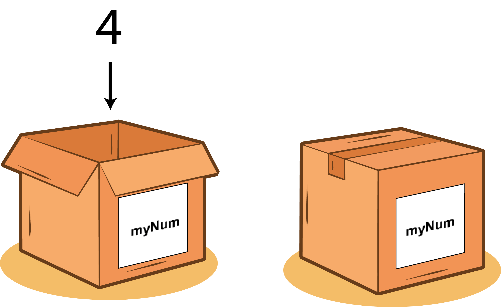

# Declare JavaScript Variables

## Article Section

**A variable is named reference to a value.**

JavaScript variables are like **containers** for storing data **values**.



For example, these three variables are assigned with values.

```
 var myNumber = 5;
 var myString = "Alan Turing";
 var myBoolean = true;
```

- **myNumber** stores the **number** 5
- **myString** stores the **string** “Alan Turing”
- **myBoolean** stores the **boolean** true

As you can see, the three variables start with a keyword `var`.

**Variable declaration starts with a keyword.**

There are two other variable keywords beside `var`, which are `let` and `const`. But, we won’t touch them until much later of this course. As of right now, let’s just focus on the `var` keyword.

All JavaScript variables must be **identified** with **unique names**. These unique names are called **identifiers**.

In order to give some variable a value we must use the **assignment operator**, which is this (`=`).

For example:

```
var myVar = "Hello World!"
```

This variable is declared with a keyword `var`, named as `myVar` and it’s assigned with a value.

`Hello World!` is assigned to `myVar` by using the **assignment operator** (`=`).

## DIY Section

A variable has already been declared, but it's undefined.

Give the variable a string value that says `"Hello World!"`.

- `myVar` should store the value `"Hello World!"`
